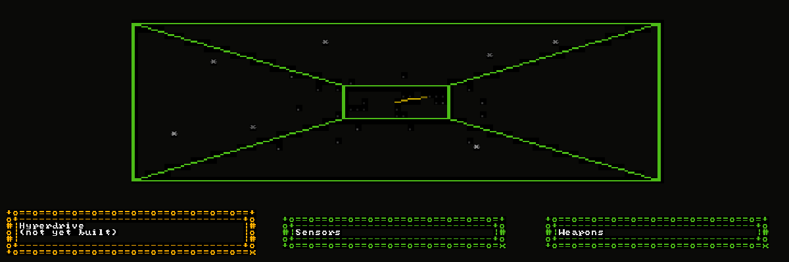

# Tate Meyer

I build the tooling that makes agent-written code trustworthy — specs
before the code, blinded critics after it, and CI as the only arbiter
of done.

Computer engineering student at KU, in Lawrence, Kansas.

  
   
  <i>TTUI, captured by Plumb — the verification tool in the next section.</i>

## Build it

### [TTUI](https://github.com/tatemeyer/ttui) · Rust · v1.1.0

A terminal UI framework built from first principles: a full render
pipeline (state → view → layout → paint → diff → writer), a
constraint-based layout engine, alpha-compositing buffer layers, and a
widget set spanning text, lists, tables, glitch effects, particle
systems, a perspective-projection camera, and data-viz. Ten example
apps and a flagship showcase reel exercise it.

## Verify it

### [Parallax](https://github.com/tatemeyer/parallax) · Rust

A platform for watching and steering agent-driven work across projects.
Its first component, **Plumb**, captures a running terminal app under a
PTY and hands the result to four *blinded* critic agents — each sees the
image and a run manifest, never the source or the diff. Their findings
merge into a single GO / NO-GO / HOLD.

The model that wrote the code doesn't get to grade it.

## Apply it

### [Model-Experiments](https://github.com/tatemeyer/Model-Experiments) · Python · PyTorch

ML research pointed at the loop itself: physics-informed ML for
electromagnetics, and JEPA work on what actually prevents
representation collapse at toy scale. Built with **Bitter Lesson
Engineering** — intent is filed as a GitHub Issue describing the desired
end state and how to verify it, an agent implements against that intent,
and CI decides when it's done.

### [SESH](https://github.com/tatemeyer/SESH) · Rust · TypeScript

A living room that knows who's in it. A Raspberry Pi 5 daemon owns the
TV, phones join by QR to queue what plays next, and presence rests on
what a passive BLE scan can actually prove — 340 addresses measured in
the room, more than half of them rotating, which is why identity has to
be carried rather than sniffed. Built in arcs, each one closed only after
an ordinary evening exercised it.

CI proves the software. The room proves the product.

## How I work

- **Spec-first** — no implementation without an approved design doc and plan.
- **Blinded verification** — the author doesn't grade the work.
- **CI is truth** — "done" is a green pipeline, not an opinion.
- **Explicit autonomy** — every unit of work declares how much human review it needs.

---

[Website](https://tatemeyer.github.io/Personal-Webpage/) · [LinkedIn](https://www.linkedin.com/in/tate-meyer2004/) · [tatemeyer04@gmail.com](mailto:tatemeyer04@gmail.com)
